# Módulo 1: Computação Básica e Acesso Seguro

Utilizaremos ao longo dos módulos o repositório oficial do nosso sistema que será implantado nas ferramentas da AWS: https://github.com/Pepoca80/projeto-flightradar. O **Projeto Flightradar** é uma aplicação baseada em sistemas distribuídos que simula o rastreamento de voos comerciais em tempo real, baseado no site [FlightRadar24](https://www.flightradar24.com). Ele foi arquitetado utilizando microsserviços conteinerizados, englobando componentes essenciais como um simulador de aviões, um servidor central, um banco de dados, um broker de mensagens MQTT e um sistema simulador de GeoDNS. 

A jornada começa com dois pilares inegociáveis: a segurança de acesso e a capacidade de processamento. Neste módulo, vamos explorar como proteger nossa conta e subir o nosso primeiro servidor virtual, preparando o terreno para hospedar os contêineres do projeto.

## 1. AWS IAM (Identity and Access Management)

O IAM é o coração da segurança na AWS. Ele é o serviço responsável por controlar quem pode acessar os recursos da sua conta e o que essas pessoas podem fazer.

### Como Funciona

Quando você cria uma conta na AWS, por padrão, você acessa usando o usuário raiz que é o "user root". O user root tem poder absoluto sobre a conta, incluindo a parte financeira, e a AWS recomenda que não seja utilizado diretamente no dia a dia. Portanto, para resolver isso, o IAM utiliza quatro conceitos fundamentais:

*   **Usuários:** entidades que representam uma pessoa ou serviço.
*   **Grupos:** coleções de usuários. Você pode colocar vários usuários em um grupo chamado Administradores, por exemplo.
*   **Políticas:** documentos escritos em JSON que definem as permissões exatas, ou seja, o que pode e o que não pode ser feito.
*   **Princípio do Privilégio Mínimo:** a regra de ouro da nuvem. Um usuário deve receber apenas as permissões estritamente necessárias para realizar o seu trabalho.

>*Painel principal do IAM onde gerenciamos as permissões e acessos da conta AWS.*
>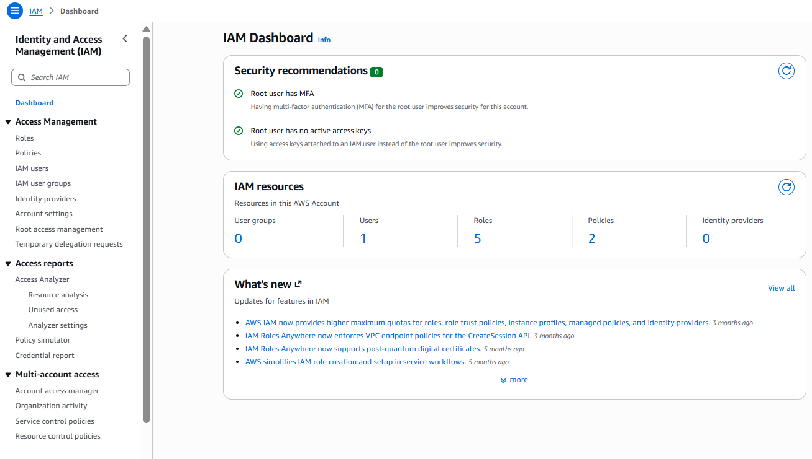

### Como Configurar o Acesso Seguro
O primeiro passo em qualquer ambiente AWS é abandonar o Usuário Raiz e criar acessos seguros.

1.  Acesse o serviço IAM no console da AWS.
2.  Navegue até a seção de Grupos de usuários e crie um grupo chamado Admins.
3.  Anexe a política AdministratorAccess a este grupo.
4.  Vá para a seção de Usuários e crie um novo usuário com o seu nome (por exemplo, ygor admin).
5.  Adicione este usuário ao grupo Admins.
6.  Gere as credenciais de acesso para o console e ative a Autenticação de Múltiplos Fatores (MFA) para garantir uma camada extra de proteção.

> **Atenção ao Acesso:** durante a criação, garanta que a opção de acesso ao **AWS Management Console** esteja ativada. Caso contrário, o usuário criado terá apenas acesso programático. Isso significa que ele só conseguirá interagir com a nuvem por meio de terminais, scripts e chamadas de API, ficando bloqueado de acessar a interface visual online.
> 
> Após finalizar a configuração, guarde a sua senha e as credenciais geradas em um local seguro. Em seguida, encerre a sessão do seu usuário raiz (root) e faça o login novamente utilizando esse novo perfil administrativo.
>
> *Aba dos "IAM user groups" dentro do IAM onde gerenciamos e criamos diferentes grupos de usuários.* 
> 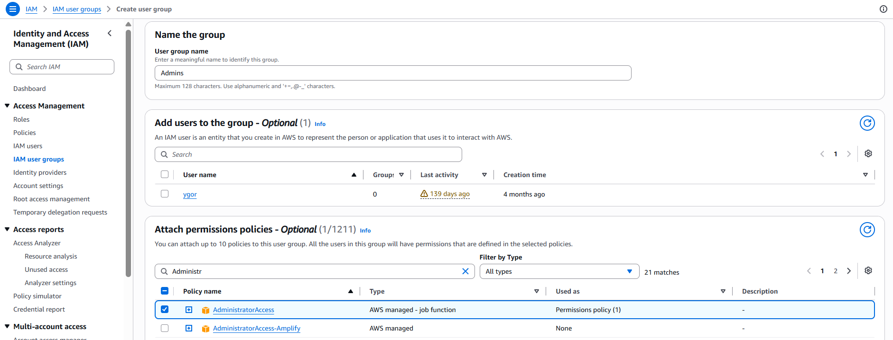
> 
> *Aba "IAM users" dentro do IAM onde conseguimos gerenciar e criar diferentes usuários que terão acesso sob o nosso domínio.*
> 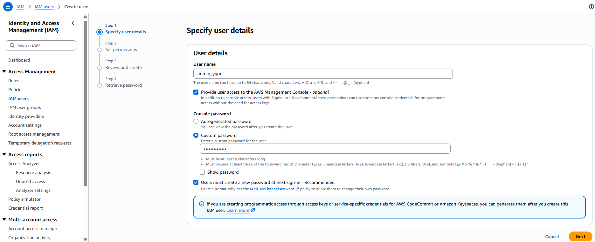
> 
> *Vinculando o nosso usuário em criação com o user group criado anteriormente.*
> 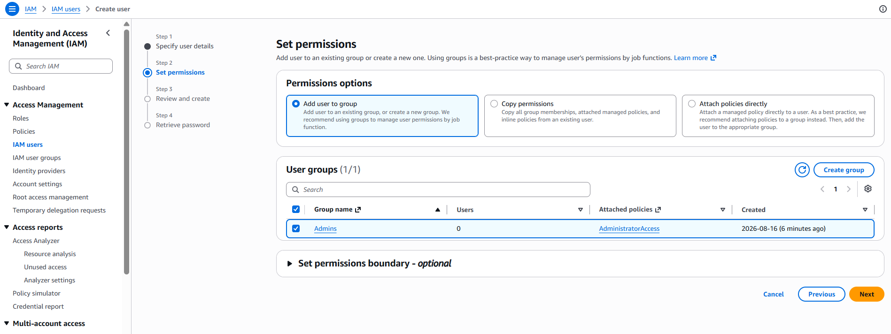
> 
> **A partir de agora o seu usuário foi criado e tem permissões nível administrador! Você deve fazer o login na AWS utilizando esse novo usuário protegido para prosseguirmos.**

## 2. Amazon EC2 e Amazon EBS

Agora com a conta segura, podemos provisionar a infraestrutura. O **Amazon EC2 (Elastic Compute Cloud)** é o serviço que fornece servidores virtuais, chamados de instâncias. É o equivalente direto a criar uma Máquina Virtual em um hipervisor clássico como o Oracle VirtualBox. Junto com o EC2, utilizamos o **Amazon EBS (Elastic Block Store)**. O EBS atua como o disco rígido da sua máquina virtual. Ele é um armazenamento em blocos que garante que o sistema operacional e os arquivos do seu servidor não sejam perdidos quando a máquina for desligada.

### Como Funcionam

Para subir uma instância EC2, você precisa definir quatro elementos principais:

*   **AMI (Amazon Machine Image):** É a imagem do sistema operacional. Pode ser um Ubuntu, um Amazon Linux, um Windows Server, entre outros.
*   **Tipo de Instância:** Define o hardware. É aqui que você escolhe a quantidade de processadores (vCPUs) e a quantidade de memória RAM. Para testes, a instância t2.micro costuma ser gratuita.
*   **Security Group:** Funciona como um firewall virtual. É nele que você define quais portas de rede estarão abertas.
*   **Par de Chaves:** Um arquivo de segurança criptografado usado para acessar o servidor remotamente via SSH, dispensando o uso de senhas fracas.

> *Página inicial do EC2 dentro do AWS Console*
> 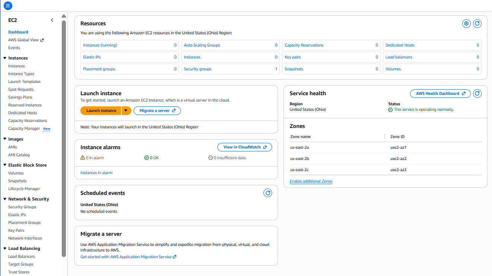

### Configurando e Subindo o Servidor

1.  Acesse o painel do EC2 e clique em Launch Instance (Executar Instância).
2.  Dê um nome ao seu servidor (exemplo: Servidor Flightradar).
3.  Selecione a imagem do Ubuntu na seção AMI.
4.  Crie um novo Key Pair (Par de Chaves), baixe o arquivo gerado no seu computador e guarde ele em um local seguro.
5.  Na seção de configurações de rede, crie um novo Security Group. Garanta que a regra que permite o tráfego SSH (Porta 22), HTTP e HTTPS estejam marcadas, pois é através delas que vamos controlar e visualizar o nosso projeto.
6.  Na seção de armazenamento, o console já vai anexar um disco EBS básico, deixe o espaço como 12GGB e prossiga.
7.  Clique no botão de lançar a instância.

> *Criando o nome do servidor e selecionando a imagem do SO*
> 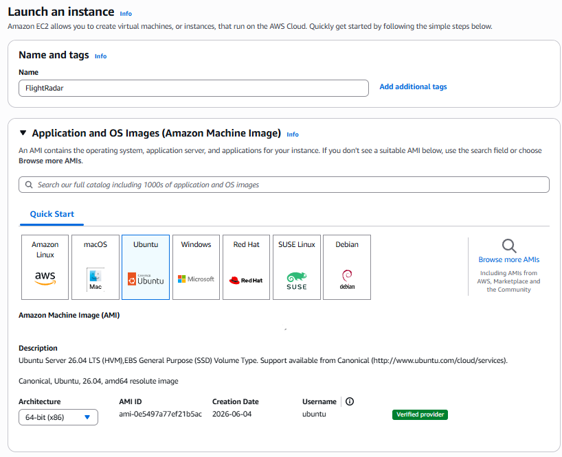
>
> *Ao acessar a sua instância EC2 de forma segura, a AWS não utilizará senhas tradicionais. Em vez disso, você deve criar uma "Key Pair". Portanto, daremos um nome fácil como "key-pair-flightradar", escolha o tipo **ED25519** e o formato **.pem**. O navegador baixará um arquivo para a sua máquina. **Guarde este arquivo com extremo cuidado**, pois ele é a única "chave" capaz de destrancar o acesso remoto ao seu servidor via terminal (SSH). Se você perdê-lo, não conseguirá mais acessar a máquina.*
> 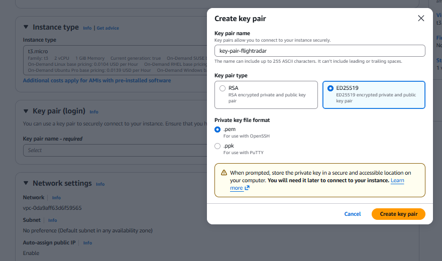 
>  
> *Criando a rede do nosso servidor*
> 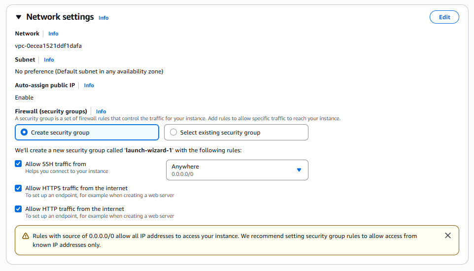
> 
> *Configurando armazenamento do nosso servidor*
> 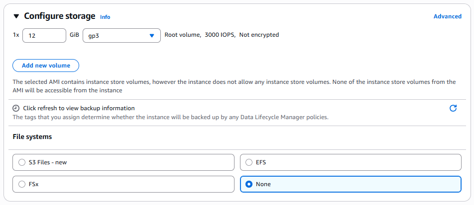
> 
>**Em alguns instantes, o seu servidor virtual estará rodando nos data centers da Amazon.**
>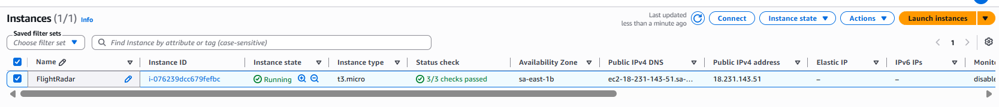

### Conectando na Instância via SSH
Com o servidor rodando perfeitamente, a próxima etapa é acessar o terminal da máquina. Você fará isso utilizando o terminal do seu próprio computador (PowerShell no Windows ou o Terminal padrão no Linux e macOS) junto com aquele arquivo `.pem` que você salvou.

**1. Preparando o Ambiente**
*   Abra o terminal no seu computador.
*   Navegue até a pasta onde o seu arquivo `.pem` foi salvo usando o comando `cd`. Exemplo: `cd Downloads`

**2. Ajustando Permissões (Linux e macOS)**
*   Sistemas baseados em Unix exigem restrição de segurança no arquivo de chave. Antes de conectar, digite o comando:
`chmod 400 key-pair-flightradar.pem`

**3. Executando a Conexão**
*   Copie o endereço IP Público da sua instância, que fica visível na tela inicial do painel EC2.
*   Execute o comando de conexão especificando o arquivo `.pem`, o usuário padrão do Ubuntu e o seu IP:

`ssh -i "key-pair-flightradar.pem" ubuntu@SEU_IP_PUBLICO`

> **Aviso de Autenticidade (Fingerprint):**
> No seu primeiro acesso, o terminal exibirá uma mensagem dizendo que a autenticidade do host não pode ser estabelecida e mostrará uma impressão digital da chave ED25519. Isso é um comportamento padrão de segurança. O seu computador está apenas avisando que nunca se conectou a esse servidor antes. Basta digitar `yes` e apertar Enter para confirmar. O IP será salvo na sua lista de hosts conhecidos e a tela de boas vindas do Ubuntu aparecerá.
>
> *Visão do terminal local demonstrando a conexão bem sucedida dentro da instância EC2 recém criada.*
> 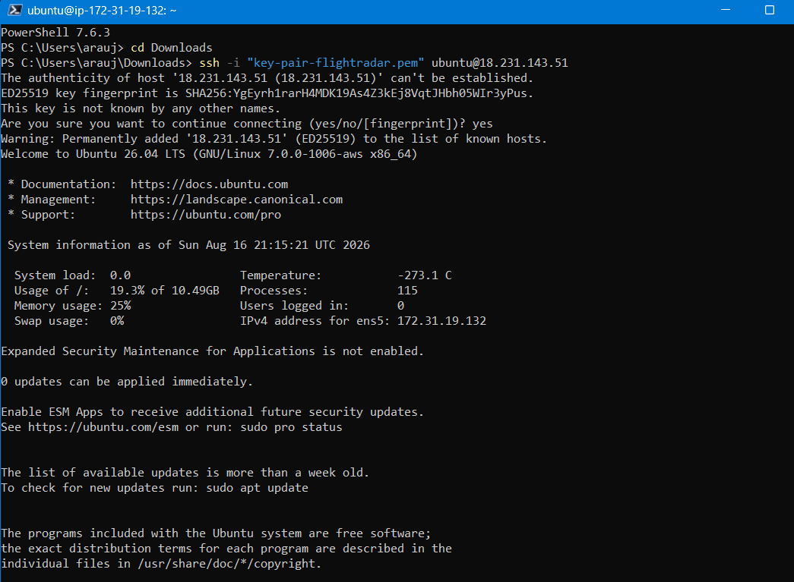

## 3. Integração dos Contêineres

O servidor virtual EC2 criado servirá como o nosso **Docker Host** (o hospedeiro dos contêineres). Como configuramos um disco persistente EBS, temos espaço para baixar as dependências do sistema. Assim, o fluxo prático para interligar a infraestrutura da nuvem ao projeto é:

**1. Acessar a instância EC2 via terminal SSH**
Conseguimos realizar essa etapa na seção anterior.

**2. Instalar o motor do Docker no ambiente Ubuntu**
Atualize a lista de pacotes do sistema e instale as dependências necessárias executando os comandos abaixo no terminal do seu servidor:

```bash
sudo apt update
sudo apt install docker.io docker-compose git -y
sudo systemctl enable docker
sudo systemctl start docker
```

**3. Clonar o repositório e acessar a pasta**
Faça o download do projeto oficial que estamos usando de teste e navegue para dentro do diretório recém criado:

```bash
git clone https://github.com/Pepoca80/projeto-flightradar
cd projeto-flightradar
```

**4. Criar Memória Swap para o Banco de Dados**
O banco de dados Cassandra é construído em Java e exige uma quantidade massiva de memória RAM para iniciar seus processos internos. Como a nossa instância gratuita t2.micro possui apenas 1GB de memória física, o sistema Ubuntu acabará matando o processo do banco de dados e gerando um "Erro 137" ao subir o Docker do Cassandra se não reservarmos mais memória, o que causará uma falha em cascata e impede o frontend de iniciar. Resolveremos isso reservando 5GB do nosso disco rígido de 12GB criado no EC2 com o servidor para atuar como memória virtual (Swap):

```bash
sudo fallocate -l 5G /swapfile
sudo chmod 600 /swapfile
sudo mkswap /swapfile
sudo swapon /swapfile
```

**5. Liberar as Portas de Comunicação na AWS**
>Para que o site carregue e os aviões se movam no mapa em qualquer outro dispositivo, o navegador precisará buscar os dados em portas especificas definidas no código do nosso projeto. Voltaremos no painel da AWS, acesse o Security Group da sua instância EC2 e adicionaremos regras do tipo "Custom TCP" liberando o acesso para qualquer origem (0.0.0.0/0) nas seguintes portas essenciais no código do container que subimos:
>
>* **80**: porta web padrão.
>* **3000**: interface visual (Frontend).
>* **4002**: acesso à API do servidor central.
>* **1892**: comunicação com o broker de mensagens MQTT.
>* **18080 e 18081**: resolução de rotas do simulador GeoDNS.
>
> 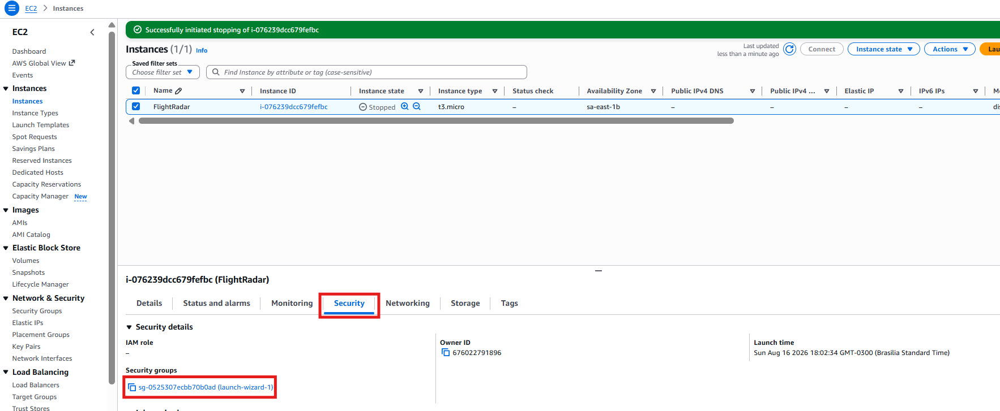
> 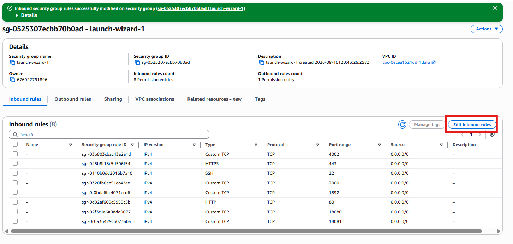

**6. Executar a inicialização do ambiente**

Inicie os serviços apontando para o arquivo de desenvolvimento do nosso projeto, que é mais leve e consome menos recursos da nuvem por subir menos containers.

```bash
sudo docker compose -f docker-compose.dev.yml up -d
```

Ao fazer isso, a sua instância EC2 fará o download das imagens necessárias e subirá simultaneamente os contêineres do projeto. Em questão de minutos, a arquitetura distribuída do Flightradar estará executando ativamente na nuvem da AWS e conseguiremos ver no nosso navegador ou de qualquer outro dispositivo.

**7. Visualizar o Projeto**
Abra o navegador em qualquer dispositivo (celular, tablet ou computador) e digite o IP Público da sua máquina EC2 acompanhado da porta 3000. Exemplo:

**http://SEU_IP_PUBLICO:3000**

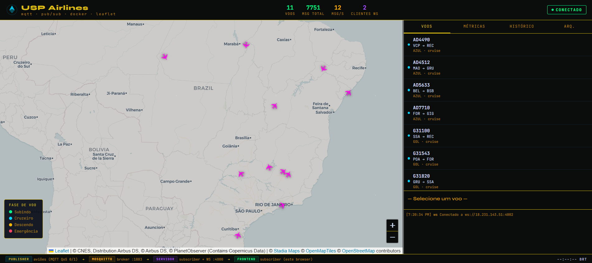

## Conclusão

Chegamos ao final do nosso primeiro módulo com a infraestrutura rodando perfeitamente! O ambiente que você acabou de configurar reflete o padrão utilizado por grandes empresas para hospedar aplicações modernas. O maior conselho para a sua jornada de aprendizado é: sempre que você criar um projeto novo que possa ser disponibilizado na internet, utilize a AWS para treinar a implantação. Configurar o básico, ajustar o acesso seguro e testar as ferramentas custa muito pouco e, na imensa maioria das vezes, sai totalmente de graça graças aos limites do nível gratuito.

A nuvem pode parecer complexa e intimidadora no primeiro contato. No entanto, a verdadeira habilidade surge através da repetição. Quanto mais você subir servidores, enfrentar barreiras de portas fechadas e lidar com falta de memória, mais rápido você dominará o assunto.
