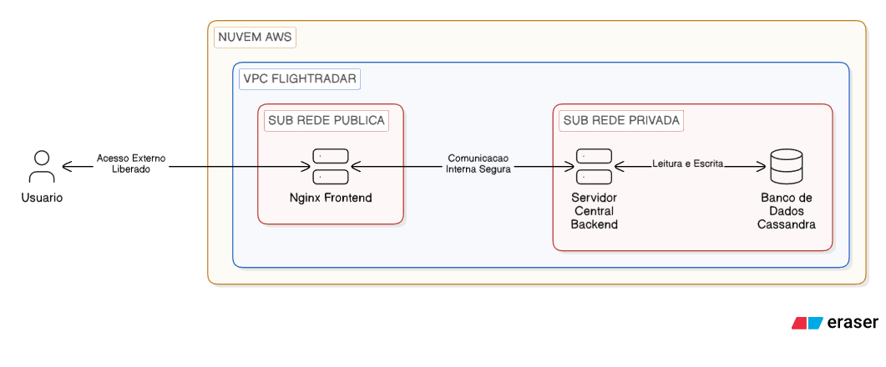
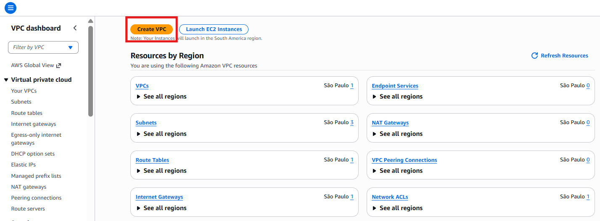
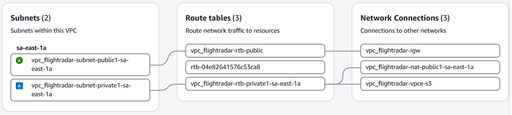
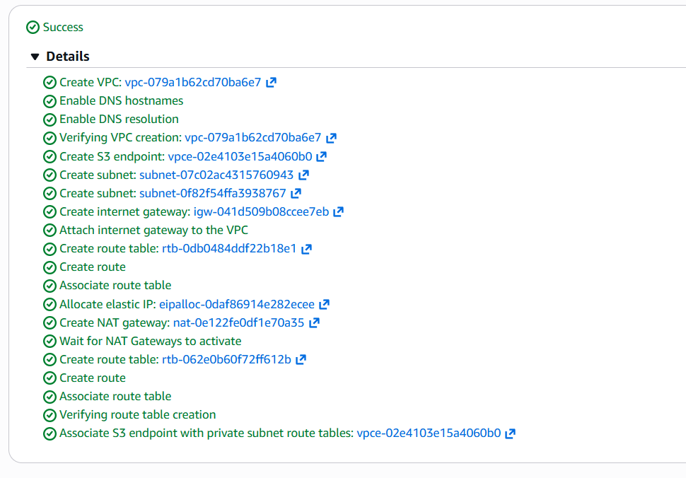
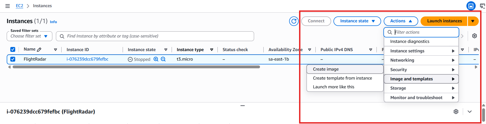
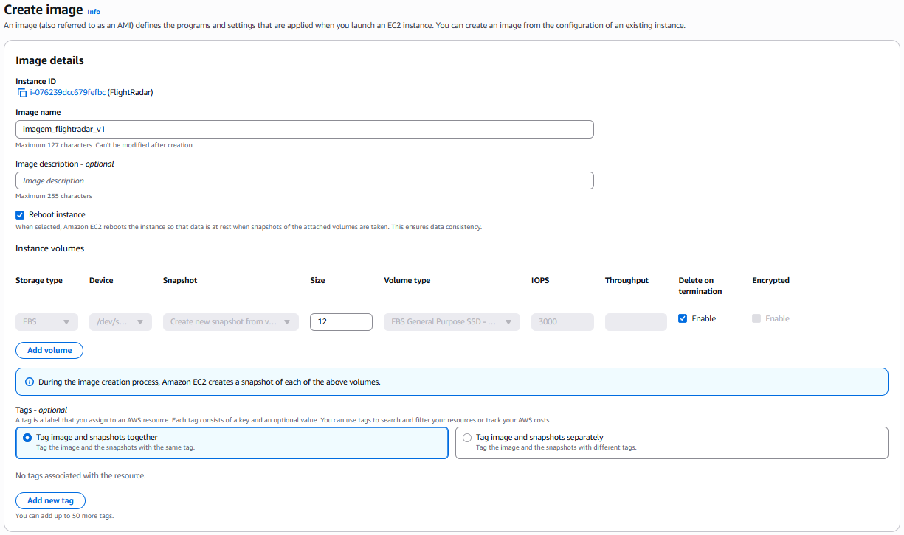
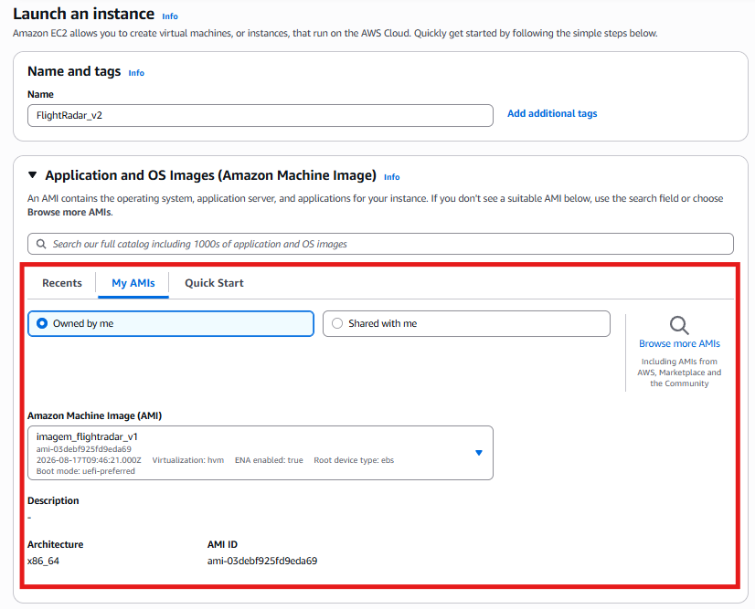
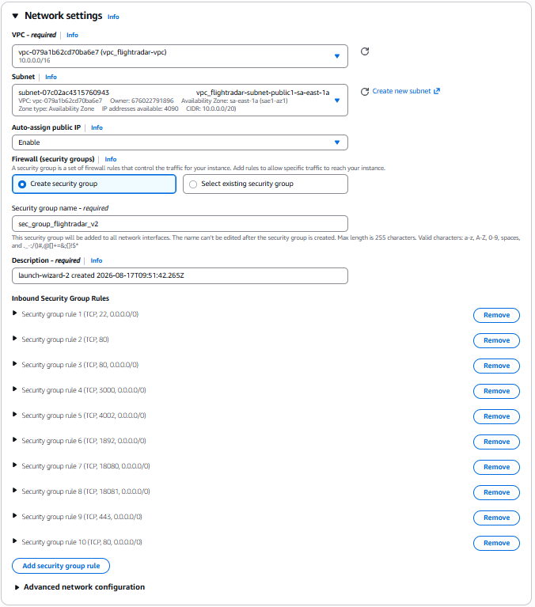
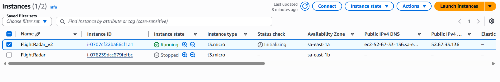

# Módulo 2: A Fundação de Redes e Armazenamento

Agora vamos aprofundar os nossos conhecimentos arquiteturais da nuvem, explorando dois pilares essenciais para a segurança e a eficiência de qualquer infraestrutura corporativa: redes isoladas e armazenamento de objetos.

## 1. Amazon VPC (Virtual Private Cloud)

A Amazon VPC é o serviço que permite criar uma rede privada e isolada logicamente dentro da AWS. Assim, é como se nós estivéssemos construindo o nosso próprio data center tradicional, mas com toda a flexibilidade e escalabilidade da nuvem.

### Conceitos Fundamentais

**VPC:** a rede principal que engloba toda a sua infraestrutura.

**Sub Redes Públicas:** áreas da rede que possuem uma rota direta para a internet por meio de um Gateway de Internet. Aqui ficam os recursos que precisam ser acessados livremente pelo público.

**Sub Redes Privadas:** áreas isoladas que não recebem tráfego direto da internet. São excelentes para proteger bancos de dados e sistemas internos.

**Gateway de Internet:** o componente da AWS que conecta a sua VPC ao mundo exterior.

**Tabelas de Roteamento:** conjunto de regras que dita para onde o tráfego de rede deve ser direcionado.

### Aplicando a VPC ao Projeto Flightradar

No Módulo 1, nós subimos todos os contêineres do projeto em uma única máquina EC2 exposta para a internet toda. Essa abordagem é excelente e rápida para testes e laboratórios. No entanto, em um ambiente corporativo real, nós separamos os componentes estruturais para garantir segurança máxima contra invasões.

Na arquitetura ideal do nosso radar de voos, o banco de dados Cassandra e o servidor backend não precisam e nem devem ser acessados diretamente pelos usuários finais. O único ponto de contato do cliente deve ser a interface visual, entregue pelo Nginx (o nosso frontend).

Utilizando a estrutura de uma VPC, a nossa arquitetura ficaria assim: o servidor Nginx seria alocado em uma **Sub rede Pública**, permitindo que qualquer pessoa consiga acessar o site pelo navegador. Já o servidor central e o Cassandra ficariam totalmente trancados em uma **Sub rede Privada**. O Nginx recebe a visita do usuário na área pública e busca os dados no backend por meio de uma ponte na rede interna. Isso isola e bloqueia completamente qualquer tentativa de ataque externo direto ao nosso banco de dados.



---

### Criando a VPC na Prática

Agora vamos colocar a mão na massa e configurar essa arquitetura de rede no painel da AWS. A Amazon possui um assistente visual excelente que cria todos os recursos básicos de uma só vez poupando muito trabalho manual.

**Passo 1: Acessar o painel da VPC**

Use o console principal da AWS e busque por VPC na barra de pesquisa superior e abra o painel do serviço.



**Passo 2: Iniciar a criação**

Clique no botão laranja escrito **Create VPC** (Criar VPC) localizado no canto superior direito da tela.

**Passo 3: Utilizar o assistente visual**

Na tela de criação selecione a opção **VPC and more** (VPC e mais). Essa opção é fantástica porque ela desenha a arquitetura na tela e cria o Gateway de Internet e as Tabelas de Roteamento automaticamente para nós. A opção "VPC only" cria apenas a fronteira da rede. Você teria que criar as Sub redes, o Gateway de Internet e as Tabelas de Roteamento uma por uma e conecta las manualmente. A opção "VPC and more" poupa dezenas de cliques ao orquestrar e interligar toda a base da rede de forma automática!

**Passo 4: Configurações Básicas**

**Name tag auto generation:** digite um nome para a sua rede como **vpc_flightradar**, por consequência, todos os recursos criados ganharão esse prefixo.

**IPv4 CIDR block:** mantenha o valor padrão (geralmente 10.0.0.0/16). Esse bloco define a quantidade de endereços de IP disponíveis para uso na sua rede interna.

**Passo 5: Configurar as Sub redes e Zonas**

**Number of Availability Zones:** selecione 1, pois para o nosso cenário de laboratório uma única zona de disponibilidade da Amazon é mais que suficiente.

**Number of public subnets:** selecione 1, pois essa será a subrede com acesso à internet do nosso frontend Nginx.

**Number of private subnets:** Selecione 1, pois essa será a parte da nossa rede totalmente fechada e segura para o nosso banco de dados Cassandra e para o servidor central, somente com acesso interno da corporação que estamos simulando.

**NAT gateways:** Selecione None (nenhum). Essa etapa é crítica para garantir que não teremos cobranças adicionais no nível gratuito da Amazon. O NAT Gateway atua como um intermediário seguro para os servidores que estão isolados. Imagine que nós queiramos que o nosso banco de dados Cassandra, que está trancado na Sub rede Privada, busque uma atualização de segurança nos servidores do Ubuntu. Como a Sub rede Privada não tem saída para o mundo externo, o download falharia. O NAT Gateway resolve isso: ele fica na Sub rede Pública, recebe o pedido do Cassandra, busca o arquivo na internet e o entrega de volta para o nosso banco de dados. A magia dele é permitir que as máquinas isoladas acessem a web para baixar dependências, ao mesmo tempo em que bloqueia implacavelmente qualquer pessoa da internet de iniciar uma conexão para dentro dessas máquinas. Ao ativar esse recurso temporariamente para realizar testes (como rodar um comando de atualização no servidor isolado), selecione sempre a opção **In 1 AZ** (Zonal). Escolher a opção Zonal garante que a AWS crie apenas um único roteador de saída, mantendo os custos sob controle, ao contrário da opção **1 per AZ** (Regional) que multiplicaria os roteadores e as cobranças de acordo com o número de zonas de disponibilidade da rede. Lembre se de deletar o recurso assim que terminar o seu teste.



**VPC endpoints:** Selecione S3 Gateway. O VPC Endpoint cria um túnel direto e invisível entre a nossa rede fechada e outros serviços da própria AWS (como o armazenamento S3, que veremos a seguir). Pense que nós requeremos simular um cenário onde o nosso servidor EC2 precise enviar um backup para o S3. Sem um endpoint, os pacotes de dados saem da nossa rede privada e trafegam pela internet pública da Amazon até chegar ao destino. Com o VPC Endpoint ativado, o tráfego nunca vê a luz da internet aberta. Os dados viajam exclusivamente pelos cabos internos de fibra óptica dos data centers da AWS, garantindo uma conexão incrivelmente veloz, blindada contra interceptações externas e que evita a cobrança de taxas de transferência de dados públicos.

**Passo 6: Finalizar a Criação**

Revise o diagrama visual que a AWS gerou na lateral direita. Você verá exatamente a Sub rede Pública ligada ao Internet Gateway através da Tabela de Roteamento Pública enquanto a Sub rede Privada permanece isolada. Role a página até o final e clique no botão **Create VPC**.



Agora em poucos minutos a AWS vai provisionar toda essa infraestrutura de rede robusta e nós temos um ambiente de data center corporativo preparado e seguro aguardando os nossos servidores virtuais.

---
### Como colocar o EC2 dentro da nova VPC?

Agora que nós criamos a nossa rede corporativa segura, como nós movemos o nosso servidor EC2 do módulo 1 para dentro dessa nova VPC? **Nós não podemos mover um servidor EC2 existente de uma VPC para outra.** Quando uma máquina virtual nasce na Amazon, ela fica permanentemente vinculada à rede em que foi criada. O nosso servidor atual está rodando na VPC Default da nossa conta.

Para passarmos a nossa aplicação para a nova rede isolada, nós precisamos criar um clone do servidor. Pense que nós requeremos simular uma migração de ambiente real de produção. Nós faremos isso através de uma AMI (Amazon Machine Image). 

Vamos colocar a mão na massa e executar essa migração passo a passo:

**Passo 1: Criar a Imagem (AMI) do servidor atual**
Acesse o painel do EC2 e clique em **Instances** (Instancias) no menu lateral.
Selecione a máquina virtual do nosso projeto que já está rodando.
No canto superior direito, clique no botão **Actions** (Ações), navegue até **Image and templates** (Imagem e modelos) e selecione **Create image** (Criar imagem).



**Passo 2: Configurando a nova imagem**
Na tela de criação, nós precisamos dar um nome para o nosso clone. Em **Image name**, digite algo como **imagem_flightradar_v1**.
Em **Image description**, você pode colocar uma breve descrição sobre o que tem nesse servidor.
Deixe o restante das configurações no padrão e clique no botão laranja **Create image** no final da página.
A AWS começará a tirar uma "foto" exata do nosso disco. Isso pode levar alguns minutos. Nós podemos acompanhar o status clicando em **AMIs** no menu lateral esquerdo sob a seção Images.



**Passo 3: Lançando o novo EC2 na nossa VPC**
Quando a nossa AMI estiver com o status Available (Disponível), selecione ela na lista e clique no botão laranja **Launch instance from AMI** (Lançar instancia a partir da AMI).
Isso abrirá a tela clássica de criação de máquina virtual que nós já conhecemos, mas com uma grande vantagem: o disco rígido já virá com todo o nosso código, os conteineres do Docker e o Nginx perfeitamente configurados!
Dê um nome para a nova máquina, como **ec2_flightradar_vpc**.
Selecione o mesmo tipo de instancia (t2.micro) e a key pair (.pem) que nós criamos no módulo 1.



**Passo 4: Migração (Configuração de Rede)**
Aqui está a etapa mais importante. Na seção **Network settings** (Configurações de rede), clique no botão **Edit** (Editar).
Em **VPC**, clique no menu suspenso e mude da rede padrão (default) para a nossa nova **vpc_flightradar**.
Em **Subnet** (Sub rede), nós devemos escolher onde a nossa máquina vai morar. Imagine que nós queiramos testar o isolamento total do banco de dados: nós escolheríamos a sub rede privada. Porém, como nós empacotamos o banco, o servidor backend e o Nginx juntos no Módulo 1 e precisamos acessar o site pelo navegador, selecione a sub rede pública. 

É fundamental destacarmos um conceito aqui: pense que nós queremos simular a arquitetura de uma grande empresa. Em um ambiente corporativo real, nós jamais colocaríamos tudo no mesmo servidor. Nós teríamos máquinas EC2 isoladas apenas para o banco de dados e para a aplicação backend rodando totalmente trancadas na sub rede privada, e um outro servidor dedicado exclusivamente ao frontend rodando na sub rede pública. Como o nosso laboratório no momento empacota tudo em um único EC2, ele precisa ficar na área pública para que possamos ver o site.

Em **Auto assign public IP** (Atribuir IP público automaticamente), mude para **Enable** (Habilitar) para garantirmos que a máquina ganhará um endereço de internet.
Configure o grupo de segurança (Security Group) para permitir tráfego HTTP, HTTPS e SSH, exatamente como fizemos no primeiro servidor.



**Passo 5: Iniciar e Limpar**
Role a página até o final e clique em **Launch instance** para criar a nova máquina.
Pronto! Nós acabamos de migrar toda a nossa aplicação para a nova infraestrutura de rede corporativa de forma elegante e sem perder nenhum arquivo.
Como boa prática de controle de custos, após validarmos que o site está abrindo corretamente no novo IP público da nova máquina, nós podemos voltar na tela de Instancias, selecionar o nosso servidor antigo do Módulo 1, clicar em **Actions**, ir em **Instance state** e depois em **Terminate** (Encerrar) para não pagarmos por duas máquinas rodando ao mesmo tempo.



**Passo 6: Reativando a Memoria Swap (Ajuste Pos Migração)**
Ao clonarmos a máquina através da AMI, o arquivo físico da Swap (que nós criamos no primeiro servidor) foi copiado perfeitamente para o novo disco rígido. No entanto, o sistema operacional Ubuntu reinicia na nova máquina sem saber que ele deve ativar esse arquivo automaticamente. A nossa memória Swap simplesmente sumirá da visualização porque nós não havíamos gravado a regra de inicialização permanente no servidor antigo.

Para reativarmos a Swap e ensinarmos ao novo sistema que aquele arquivo específico deve ser usado como proteção de memória em todas as inicializações futuras, nós acessamos a nova instancia via SSH e rodamos os comandos abaixo:

```bash
sudo swapon /swapfile
echo '/swapfile none swap sw 0 0' | sudo tee -a /etc/fstab
```

Esse ponto pode ser contonardo escolhendo uma máquina com um pouco mais de memória ram do que a t2.micro, todavia talvez consuma um pouco mais de dólares por hora do que a máquina mais básica consumiria.

### Conclusão

Imagine que nós queiramos aplicar esse conhecimento em um cenário real de trabalho. Com essa base de redes que nós construímos, nós já possuímos a capacidade de arquitetar sistemas blindados contra acessos não autorizados, bloqueando ataques externos e entendendo perfeitamente como o tráfego flui pelas tabelas de roteamento.