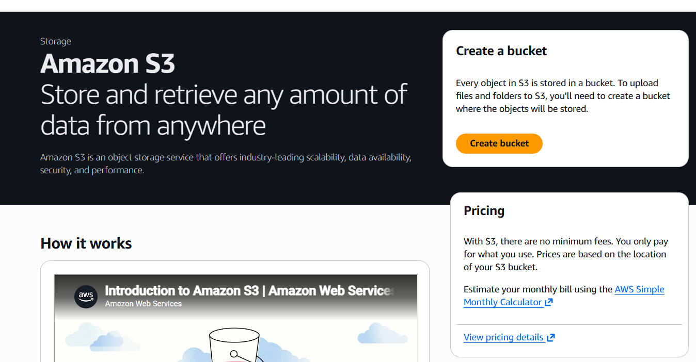
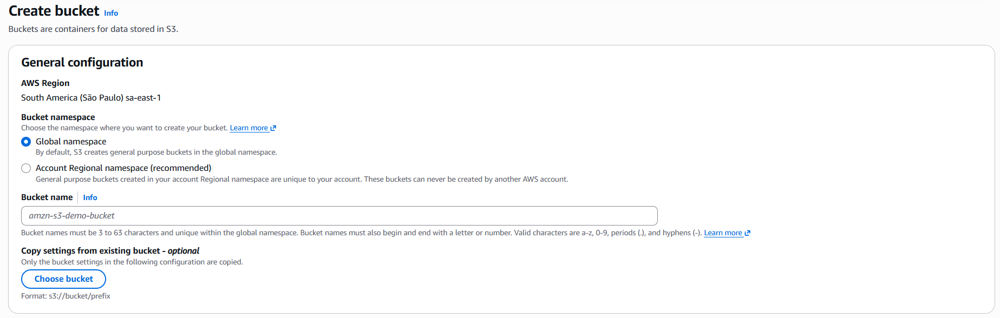
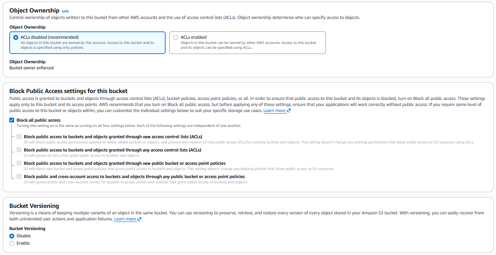
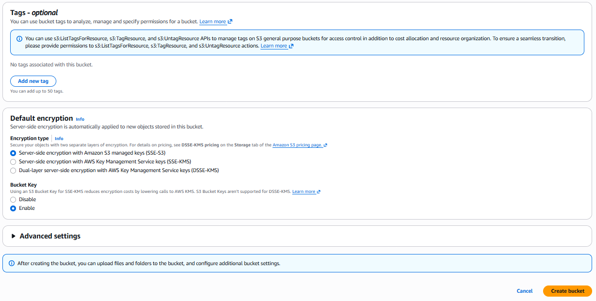
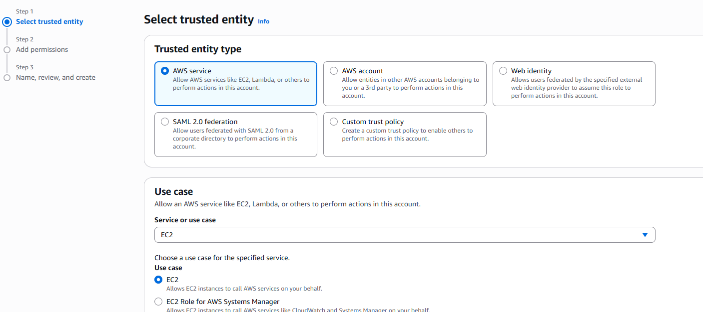
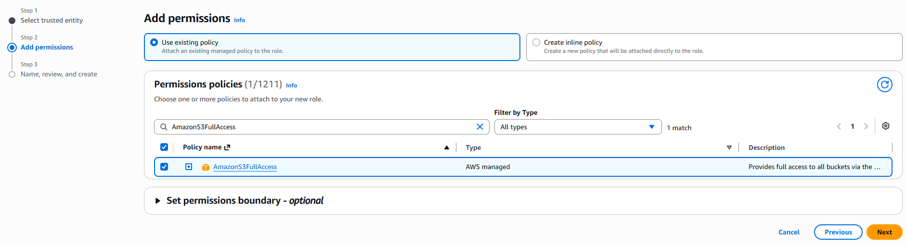
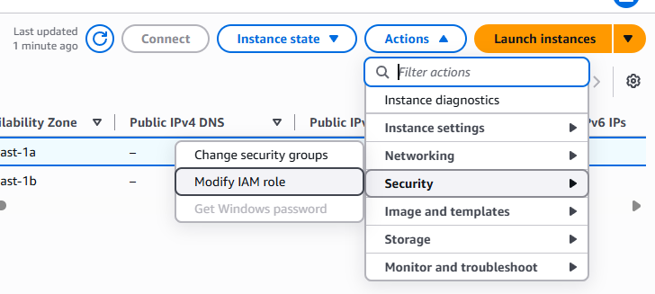

# Módulo 3: Amazon S3 e o Armazenamento de Objetos

Neste terceiro módulo, nós vamos explorar o Amazon S3 (Simple Storage Service), um dos serviços mais fundamentais e poderosos da AWS. Pense que nós requeremos simular um ambiente corporativo onde os nossos dados precisam ser armazenados com extrema segurança, de forma barata e com capacidade infinita de expansão. É exatamente aqui que o S3 brilha!



## O que é o Amazon S3 e como ele é utilizado?

O disco EBS que nós acoplamos no nosso servidor EC2 funciona como um disco rígido tradicional para rodar o sistema operacional, já o S3 é um armazenamento de objetos. Ele funciona como um grande cofre virtual na internet semelhante ao Google Drive ou Microsoft Onedrive, todavia com um potencial quase infinito. Nós não instalamos sistemas operacionais ou bancos de dados nele, mas podemos guardar qualquer tipo e quantidade de arquivo: fotos, vídeos, relatórios, planilhas e arquivos de texto.

O S3 é amplamente utilizado nas empresas para:
1. **Hospedagem de Arquivos Estáticos:** guardar imagens e arquivos HTML de sites, tirando o peso de processamento dos servidores principais.
2. **Data Lakes:** armazenar volumes massivos de dados brutos para alimentar sistemas de Inteligência Artificial e análises avançadas de dados.
3. **Armazenamento de Logs e Backups:** guardar o histórico de acessos, registros do sistema e cópias de segurança do banco de dados de forma durável e com custo muito baixo.

## Praticando: Enviando logs do EC2 para o S3

Imagine que nós queiramos auditar quem está acessando o nosso site do Flightradar. O Nginx, que nós configuramos como frontend, gera automaticamente um arquivo chamado **access.log** com o registro detalhado de todas as visitas e requisições. Em vez de deixarmos esse arquivo crescendo infinitamente e enchendo o nosso disco EBS (que é mais caro), nós podemos transferir esses registros para o S3.

### Como fazemos isso?

Enviaremos o arquivo do nosso servidor EC2 diretamente para o cofre do S3 de forma segura e automatizada, seguindo uma arquitetura de permissões dividida em três passos principais:

**Passo 1: Criar o Bucket S3 com Segurança Corporativa**

Primeiro, nós acessamos o painel do S3 na AWS e clicamos em **Create bucket**. O assistente da Amazon nos apresentará várias configurações fundamentais de arquitetura. Vamos preencher cada uma delas juntos:

1. **AWS Region:** Selecione a região **South America (São Paulo) sa-east-1**. Isso é importante para manter o nosso cofre na mesma localidade física do nosso servidor EC2, garantindo altíssima velocidade de transferência de dados.
2. **Bucket namespace:** Selecione a opção **Account Regional namespace (recommended)**. A Amazon recomenda essa nova abordagem pois ela cria um nome que será único apenas dentro da sua conta, evitando conflitos globais de nomenclatura.



3. **Bucket name:** Aqui nós devemos dar um nome único para a nossa pasta raiz. O S3 possui regras estritas: não é permitido usar letras maiúsculas ou sublinhados. Vamos utilizar tudo minúsculo e junto, por exemplo: **logs-flightradar**.
4. **Object Ownership:** Selecione **ACLs disabled (recommended)**. Pense que nos queremos simular as melhores e mais modernas práticas de segurança do mercado. Desativar as antigas Listas de Controle de Acesso (ACLs) garante que somente as políticas modernas de permissões ditarão quem pode interagir com o nosso bucket, evitando brechas.
5. **Block Public Access settings for this bucket:** Deixe a opção **Block all public access** totalmente ativada. Imagine que nos queiramos auditar acessos confidenciais do sistema e nós não podemos, em hipótese alguma, deixar que pessoas não autorizadas na internet tenham a chance de acessar esses logs.
6. **Bucket Versioning:** Selecione **Disable**. Como os nossos arquivos de log gerados já possuem nomes únicos baseados em data e não são reescritos, nós não precisamos pagar taxas extras para a AWS guardar múltiplas versões históricas do exato mesmo arquivo.



7. **Tags:** Aqui nós podemos pular e deixar a seção de "Add new tag" em branco.
8. **Default encryption:** Mantenha a opção **Server-side encryption with Amazon S3 managed keys (SSE-S3)** selecionada e a opção Bucket Key como **Enable**. Assim, nós ativamos uma camada essencial de segurança gratuita: a Amazon criptografará os nossos logs de forma automática e invisível assim que eles aterrissarem nos discos do data center.



Revise todas as configurações e, no final da página, clique no botão **Create bucket**.

**Passo 2: Configurar a Permissão do Servidor (IAM Role)**

Por padrão de segurança rigoroso da AWS, o nosso servidor EC2 não tem permissão para escrever nada no S3. Pense que nos requeremos simular a criação de um crachá de acesso exclusivo para ele. Nós vamos ao serviço chamado IAM da AWS, criamos uma Função de Segurança (Role) que permite gravar dados no S3 e anexamos esse crachá virtual no nosso servidor EC2. Essa é a forma mais segura de integração, pois evita a necessidade de criarmos e salvarmos senhas dentro do código do projeto.

A execução exata dessa liberação ocorre da seguinte maneira:

1. No console principal da AWS, pesquise por **IAM** e abra o painel desse serviço.
2. No menu lateral, clique em **Roles** (Funções) e em seguida no botão **Create role** (Criar função).
3. Na etapa Trusted entity type, selecione **AWS service** e logo abaixo escolha **EC2** como Use case. Isso indica diretamente para a Amazon que a nossa máquina virtual usará esse crachá. Clique em avançar.



4. Na aba Add permissions, pesquise na barra de busca por **AmazonS3FullAccess**. Marque a caixa de seleção ao lado dessa política de permissão e avance.
5. Dê um nome para a sua função no campo Role name, como por exemplo **permissao_S3_flightradar** e clique em **Create role** no final da tela.



6. Agora nós vamos colocar o crachá no nosso servidor de forma física virtualmente! Volte ao painel do EC2 e selecione a máquina do nosso projeto na lista.
7. No canto superior direito, clique em **Actions** (Ações), vá em **Security** (Segurança) e clique em **Modify IAM role**.
8. No menu suspenso, selecione a função permissao_S3_flightradar que acabamos de criar e clique no botão **Update IAM role**. Pronto, a nossa máquina virtual tem passe livre para o nosso cofre!



**Passo 3: Enviar o arquivo usando o AWS CLI**

O sistema Ubuntu da nossa máquina EC2 nos permite utilizar o AWS CLI (a interface de linha de comando oficial da Amazon). Com o "crachá" do Passo 2 configurado, nós acessamos o servidor pelo terminal e rodamos os comandos para extrair e copiar os dados.

Para colocarmos isso em prática na tela preta:

1. Acesse o seu servidor EC2 via SSH pelo seu terminal, da mesma forma que fizemos nos módulos anteriores.
2. Imagine que nos queiramos garantir que a ferramenta oficial de comunicação da AWS esteja instalada e atualizada no Ubuntu. Para isso, rode os comandos de instalação e correção de dependências:

```bash
sudo apt update
sudo apt --fix-broken install
sudo apt install awscli
```

3. Como nós empacotamos a nossa aplicação dentro do Docker no primeiro módulo, o nosso servidor Nginx está rodando de forma totalmente isolada. Os registros de acesso não ficam soltos nas pastas do sistema operacional. Nós precisamos navegar até a pasta do projeto e pedir para o Docker extrair o histórico do frontend com privilégios de administrador e salvar em um novo arquivo de texto. Rode os comandos exatos abaixo:

```bash
cd ~/projeto-flightradar
sudo docker compose -f docker-compose.full.yml logs frontend > access.log
```

4. Agora que o arquivo access.log foi gerado fisicamente na nossa pasta, o comando da AWS usa a lógica simples de copiar a origem local para o destino no Bucket. Rode a instrução de envio no seu terminal:

```bash
aws s3 cp access.log s3://NOME-BUCKET/
```

Ao executar essa instrução, o log de acessos do Nginx viaja pela rede interna da AWS e é guardado de forma segura, barata e isolada no nosso Bucket! Para comprovar o sucesso da nossa arquitetura, basta você voltar ao painel do S3 pelo navegador, abrir o seu Bucket e o arquivo de log estará lá perfeitamente salvo e disponível para análise.